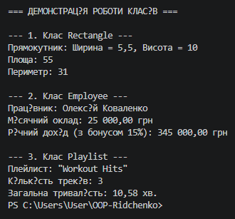

# Звіт до Самостійної роботи №1

**Тема:** Базовий синтаксис C# і оголошення класів  
**Дисципліна:** Об’єктно-орієнтоване програмування  
**Навчальний заклад:** Рівненський фаховий коледж інформаційних технологій  
**Обсяг:** 2 години  

---

## 1. Мета роботи
Закріпити навички оголошення класів, приватних полів, властивостей (зокрема `read-only`), конструкторів та методів у мові програмування C# для моделювання об’єктів реального світу.

---

## 2. Структура проєкту

Проєкт створено за допомогою консольної команди `.NET CLI`.

Для моделювання об'єктів реального світу реалізовано 3 класи:
- **`Rectangle`** — геометрична сутність. Містить приватні поля для ширини та висоти, властивості для доступу до них, а також методи для обчислення площі й периметра.
- **`Employee`** — сутність співробітника. Зберігає інформацію про ім'я та щомісячний оклад, а також містить метод обчислення річного доходу з урахуванням бонусного відсотка.
- **`Playlist`** — сутність музичного плейлиста. Зберігає назву, кількість треків і загальну тривалість. Дозволяє додавати нові треки та розраховувати загальний час відтворення у хвилинах.

У головному класі програма створює екземпляри кожного класу, передає початкові дані через конструктори, викликає їхні методи та виводить отримані результати у консоль.

---

## 3. Результат виконання програми

У консолі демонструється послідовна робота створених класів:
1. **Rectangle:** виведення початкових розмірів прямокутника, після чого розраховуються та виводяться його площа й периметр.
2. **Employee:** виведення імені працівника, його окладу та розрахованої підсумкової суми річного доходу з урахуванням доданого бонусу.
3. **Playlist:** виведення назви плейлиста, підсумкової кількості доданих треків та їхньої загальної тривалості, перерахованої із секунд у хвилини.

---

## 4. Відповіді на контрольні запитання

1. **Які мінімальні елементи повинен містити клас у цьому завданні?**  
   - Щонайменше 2 приватні поля для зберігання стану.
   - Публічну властивість (з `get` та/або `set`) для доступу до даних.
   - Конструктор із параметрами для ініціалізації полів.
   - Щонайменше 1 метод із певною логікою чи обчисленнями.

2. **Чому поля доцільно робити приватними, а доступ до них надавати через властивості?**  
   - Це реалізує принцип **інкапсуляції**. Приватні поля захищені від несанкціонованої модифікації ззовні, а властивості дають змогу перевіряти коректність даних перед зміною та обмежувати доступ (наприклад, робити властивості тільки для читання).

3. **Для чого в класі потрібен конструктор і як він пов’язаний зі станом об’єкта?**  
   - Конструктор гарантує, що об’єкт буде створений із визначеними та коректними початковими даними. Він ініціалізує початковий стан об’єкта в момент виклику оператора `new`.

4. **Як у Main показати, що методи класу працюють коректно?**  
   - Необхідно створити екземпляр класу через конструктор, викликати його методи та вивести отримані значення у консоль за допомогою `Console.WriteLine()` для перевірки результатів.

---

## 5. Висновки
У ході виконання самостійної роботи було закріплено практичні навички роботи з базовим синтаксисом C#, створено 3 класи для моделювання об'єктів реального світу з використанням інкапсуляції, властивостей, конструкторів та методів, а також продемонстровано їхню коректну роботу в консольному додатку.

