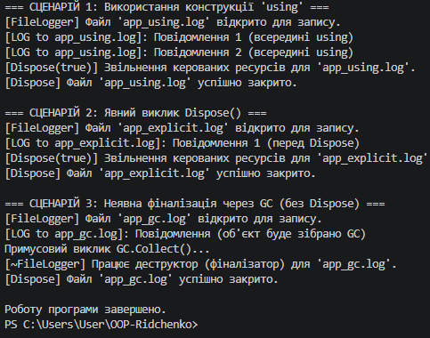

# Лабораторна робота №3

**Тема:** Життєвий цикл об’єкта та керування ресурсами  
**Варіант:** №1 (Клас `FileLogger`)  
**Інструменти:** .NET SDK, C#  

---

## Відповіді на контрольні запитання

1. **Що таке життєвий цикл об’єкта в .NET?**  
   Це послідовність етапів існування об'єкта в пам'яті: створення (виділення пам'яті в купі та виклик конструктора), використання (доступ через посилання), збирання сміття (виявлення втрачених посилань) та фіналізація із викликом деструктора.

2. **Яка різниця між керованими та некерованими ресурсами?**  
   Керовані ресурси — це пам'ять під об'єкти .NET, яка автоматично очищається збирачем сміття (GC). Некеровані ресурси — це операційні дескриптори (файли, сокети, з'єднання з БД), звільнення яких вимагає явних дій розробника.

3. **Для чого призначений інтерфейс `IDisposable`?**  
   Він надає метод `Dispose()` для явного, детермінованого та оперативного звільнення некерованих ресурсів до того, як об'єкт буде оброблено збирачем сміття.

4. **Як оператор `using` допомагає в керуванні ресурсами?**  
   Це синтаксичний цукор для конструкції `try-finally`. Він гарантує виклик `Dispose()` при виході з області видимості, незалежно від того, чи завершився блок успішно, чи стався виняток.

5. **Навіщо в патерні Dispose використовується метод `GC.SuppressFinalize(this)`?**  
   Він повідомляє GC, що об'єкт уже повністю очищено вручну, тому викликати його деструктор (фіналізатор) більше не потрібно, що оптимізує продуктивність.

6. **Чому в деструкторі викликається `Dispose(false)`, а в методі `Dispose()` — `Dispose(true)`?**  
   При `Dispose(true)` безпечно звільняти і керовані, і некеровані ресурси. При `Dispose(false)` (з деструктора) звільняють тільки некеровані ресурси, оскільки пов'язані керовані об'єкти вже могли бути видалені збирачем сміття.

---

## Висновок

Під час виконання лабораторної роботи було досліджено життєвий цикл об’єкта та механізми керування ресурсами в .NET на прикладі класу `FileLogger`. На практиці реалізовано повний патерн `Dispose`, що включає інтерфейс `IDisposable`, захищений віртуальний метод `Dispose(bool)` та деструктор (`~FileLogger()`). 

Порівняння трьох сценаріїв показало:
* Конструкція `using` є найбезпечнішим способом, оскільки гарантує детерміноване звільнення ресурсів навіть при виникненні винятків.
* Явний виклик `Dispose()` дозволяє точно контролювати момент закриття ресурсів, а прапорець `_disposed` запобігає повторній очистці.
* Фіналізація через GC (`~FileLogger()`) слугує аварійною сіткою на випадок забудькуватості розробника, проте звільнення ресурсів відбувається недетерміновано.

Застосування `GC.SuppressFinalize(this)` дозволило уникнути зайвого навантаження на потік фіналізації для об'єктів, ресурси яких вже були успішно звільнені. 
