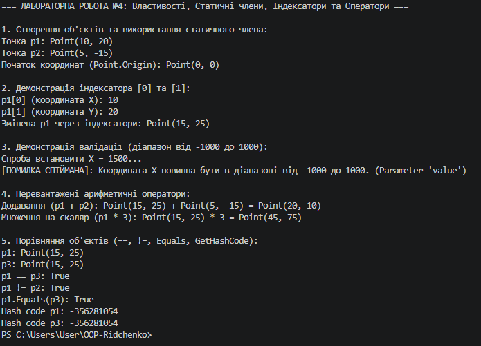

# ЗВІТ
### з лабораторної роботи №4
**З дисципліни:** «Об’єктно-орієнтоване програмування»  
**Тема:** Властивості та статичні члени. Індексатори й перевантаження операторів.  
**Студент(ка):** [Ваше Прізвище та Ім’я]  
**Група:** [Назва вашої групи]  
**Варіант:** №1 (Клас `Point`)  

---

## 1. Мета роботи
Опанувати реалізацію властивостей із валідацією, статичних членів класу, індексаторів та перевантаження операторів у C# для створення зручних і виразних класів.

---

## 2. Теоретичні відомості
* **Властивості з валідацією:** дозволяють контролювати значення полів класу через `set`-аксесор, забезпечуючи цілісність даних.
* **Статичні члени:** належать самому класу, а не його об'єктам (наприклад, `Point.Origin`).
* **Індексатори:** забезпечують доступ до елементів об'єкта через квадратні дужки `[]`.
* **Перевантаження операторів:** дозволяє перевизначити стандартні оператори (`+`, `*`, `==`, `!=`) для екземплярів класу.
* **Методи `Equals()`, `GetHashCode()`, `ToString()`:** перевизначаються для правильного порівняння об'єктів за значенням та їх роботи в хеш-колекціях.

---

## 3. Хід виконання роботи

1. **Створення проєкту:** У терміналі створено консольний проєкт за допомогою команди `dotnet new console -o OOP-Ridchenko/lab4v1`.
2. **Реалізація класу `Point`:**
   * Створено приватні поля `_x`, `_y` та властивості `X`, `Y` з перевіркою діапазону від `-1000` до `1000`.
   * Додано статичну властивість `Point.Origin` (повертає точка `(0, 0)`).
   * Реалізовано індексатор `this[int index]` (`0` для X, `1` для Y).
   * Перевантажено оператори `+`, `*` (скаляр), `==` та `!=`.
   * Перевизначено методи `ToString()`, `Equals()` та `GetHashCode()`.
3. **Тестування у `Main`:** Перевірено створення об'єктів, роботу індексатора, генерацію помилки при некоректних даних, додавання/множення точок та їх порівняння.
4. **Git:** Створено коміт та завантажено проєкт на GitHub.

---

## 4. Відповіді на контрольні запитання

1. **Різниця між властивістю та індексатором:** Властивість звертається до конкретного поля за іменем (`p.X`), а індексатор — за допомогою квадратних дужок із параметром (`p[0]`).
2. **Навіщо перевизначати `Equals()` та `GetHashCode()`:** Це необхідно для єдиної логіки порівняння "за значенням" для `==` та `Equals()`, а також для коректної роботи об'єктів у хеш-колекціях (`HashSet`, `Dictionary`).
3. **Коли використовувати статичні члени:** Коли дані або методи належать самому типу, а не екземпляру (константи, допоміжні функції як `Math.Abs()`, фабричні методи).
4. **Роль інкапсуляції у цілісності даних:** Поля `private` захищені від прямого змінення, а властивості перевіряють вхідні значення, унеможливлюючи створення об'єкта з некоректним станом.

---

## 5. Висновок
Під час лабораторної роботи №4 було створено клас `Point` із використанням валідації властивостей, статичного члена `Origin`, індексатора та перевантажених операторів. На практиці засвоєно принципи інкапсуляції та порівняння об'єктів у C#.

